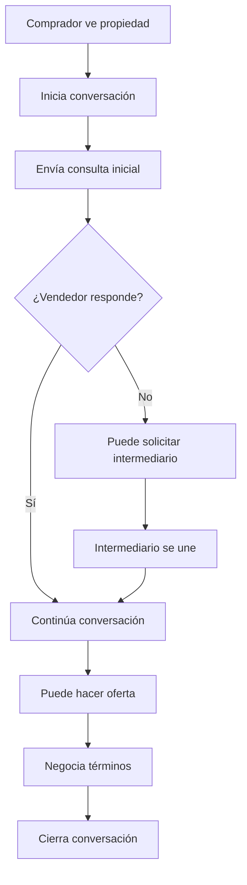
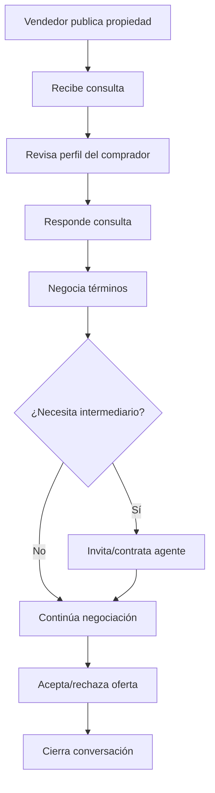
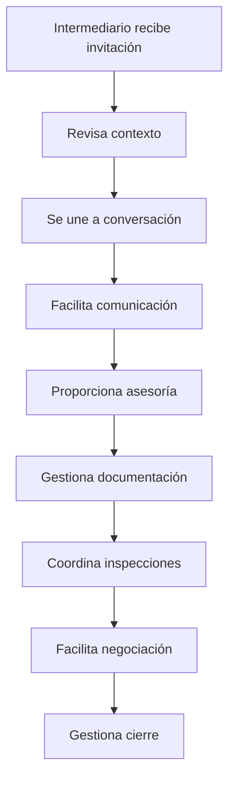

# Roles y Permisos de Usuarios - Sistema de Chat Inmobiliario

## 1. Definición de Roles

### 1.1 Comprador (Buyer)
**Descripción**: Usuario interesado en adquirir una propiedad.

**Características**:
- Puede buscar y explorar propiedades
- Inicia conversaciones con vendedores
- Puede solicitar la mediación de un intermediario
- Realiza consultas y ofertas

**Datos del Perfil**:
- Información personal básica
- Preferencias de búsqueda (ubicación, precio, tipo)
- Presupuesto disponible
- Historial de consultas

### 1.2 Vendedor (Seller)
**Descripción**: Usuario propietario que desea vender una propiedad.

**Características**:
- Publica propiedades en la plataforma
- Responde a consultas de compradores
- Puede contratar servicios de intermediarios
- Gestiona múltiples conversaciones por propiedad

**Datos del Perfil**:
- Información personal básica
- Propiedades registradas
- Documentación de propiedad
- Historial de ventas

### 1.3 Intermediario/Agente (Agent)
**Descripción**: Profesional inmobiliario que facilita transacciones entre compradores y vendedores.

**Características**:
- Mediador en conversaciones
- Acceso a múltiples conversaciones
- Herramientas profesionales adicionales
- Puede representar tanto compradores como vendedores

**Datos del Perfil**:
- Información profesional completa
- Licencia inmobiliaria
- Agencia a la que pertenece
- Área de cobertura geográfica
- Especialización por tipo de propiedad

## 2. Matriz de Permisos

### 2.1 Gestión de Conversaciones

| Acción | Comprador | Vendedor | Intermediario |
|--------|-----------|----------|---------------|
| Crear conversación nueva | ✅ | ✅ | ✅ |
| Unirse a conversación existente | ❌ | ❌ | ✅* |
| Ver historial completo | ✅ | ✅ | ✅ |
| Archivar conversación | ✅ | ✅ | ✅ |
| Eliminar conversación | ❌ | ❌ | ✅** |
| Invitar terceros | ❌ | ❌ | ✅ |

*Solo si es invitado o tiene relación con alguna de las partes
**Solo por motivos de moderación o cumplimiento

### 2.2 Envío de Mensajes

| Tipo de Mensaje | Comprador | Vendedor | Intermediario |
|-----------------|-----------|----------|---------------|
| Texto normal | ✅ | ✅ | ✅ |
| Archivos/Imágenes | ✅ | ✅ | ✅ |
| Documentos legales | ❌ | ✅ | ✅ |
| Ofertas formales | ✅ | ✅ | ✅ |
| Mensajes del sistema | ❌ | ❌ | ✅ |
| Programar citas | ✅ | ✅ | ✅ |

### 2.3 Acceso a Información

| Información | Comprador | Vendedor | Intermediario |
|-------------|-----------|----------|---------------|
| Datos personales básicos | Propios + Públicos | Propios + Públicos | Clientes asignados |
| Información de contacto | Limitado | Limitado | Completo*** |
| Historial de conversaciones | Propias | Propias | Clientes asignados |
| Estadísticas de actividad | Propias | Propias | Dashboard completo |
| Reportes de transacciones | No | Propias | Clientes asignados |

***Solo de clientes que han autorizado la representación

### 2.4 Funciones Administrativas

| Función | Comprador | Vendedor | Intermediario |
|---------|-----------|----------|---------------|
| Moderar conversaciones | ❌ | ❌ | ✅ |
| Reportar problemas | ✅ | ✅ | ✅ |
| Bloquear usuarios | ✅ | ✅ | ✅ |
| Acceso a analytics | ❌ | Básico | Avanzado |
| Configurar automatizaciones | ❌ | ❌ | ✅ |

## 3. Flujos de Interacción por Rol

### 3.1 Flujo del Comprador

### 3.2 Flujo del Vendedor

### 3.3 Flujo del Intermediario

## 4. Reglas de Negocio por Rol

### 4.1 Restricciones del Comprador
- No puede contactar directamente al vendedor fuera de la plataforma inicialmente
- Límite de 5 conversaciones activas simultáneas
- No puede acceder a información de contacto hasta mostrar interés serio
- Debe verificar identidad para hacer ofertas formales

### 4.2 Restricciones del Vendedor
- Debe responder a consultas en máximo 48 horas
- No puede eliminar conversaciones con ofertas pendientes
- Debe mantener información de propiedad actualizada
- Obligatorio declarar si usa intermediario

### 4.3 Restricciones del Intermediario
- Debe tener licencia válida verificada
- No puede representar ambas partes sin declararlo
- Límite de 50 conversaciones activas simultáneas
- Debe mantener certificaciones actualizadas

## 5. Niveles de Acceso Detallados

### 5.1 Nivel Básico (Todos los Roles)
- Chat en tiempo real
- Envío de archivos básicos
- Notificaciones estándar
- Perfil público limitado

### 5.2 Nivel Verificado (Usuarios con Identidad Confirmada)
- Acceso a información de contacto
- Capacidad de hacer ofertas formales
- Programar citas presenciales
- Historial de transacciones

### 5.3 Nivel Profesional (Solo Intermediarios)
- Dashboard de analytics
- Herramientas de CRM integradas
- Automatización de respuestas
- Reportes avanzados
- API access para integraciones

## 6. Configuración de Privacidad

### 6.1 Configuraciones Disponibles
- **Visibilidad del perfil**: Público, Solo contactos, Privado
- **Información de contacto**: Oculto, Solo verificados, Todos
- **Historial de actividad**: Visible, Solo estadísticas, Oculto
- **Notificaciones**: Inmediatas, Resumen diario, Desactivadas

### 6.2 Configuraciones por Defecto

| Configuración | Comprador | Vendedor | Intermediario |
|---------------|-----------|----------|---------------|
| Visibilidad del perfil | Solo contactos | Público | Público |
| Info de contacto | Solo verificados | Solo verificados | Todos |
| Historial de actividad | Solo estadísticas | Solo estadísticas | Visible |
| Notificaciones | Inmediatas | Inmediatas | Resumen diario |

## 7. Escalamiento de Permisos

### 7.1 Proceso de Verificación
1. **Verificación básica**: Email + Teléfono
2. **Verificación de identidad**: Documento oficial
3. **Verificación profesional**: Licencia + Colegio profesional (solo intermediarios)
4. **Verificación financiera**: Estado de cuenta (opcional para compradores)

### 7.2 Beneficios por Nivel
- **Verificado**: +50% de permisos y funcionalidades
- **Profesional**: +100% de herramientas disponibles
- **Premium**: Funcionalidades avanzadas y soporte prioritario