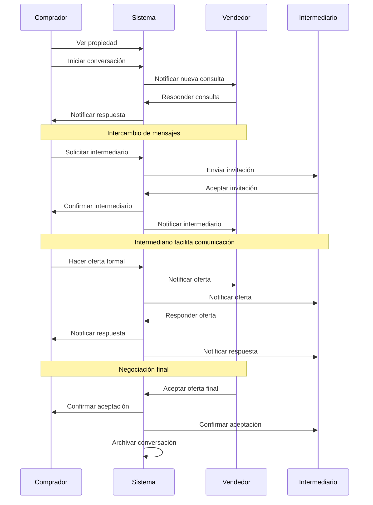
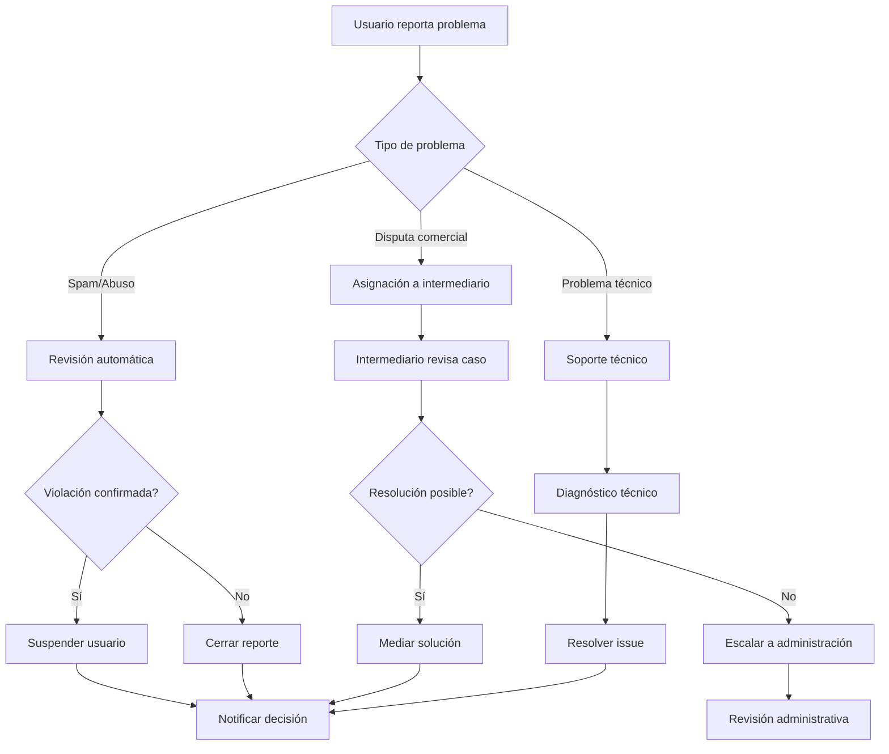
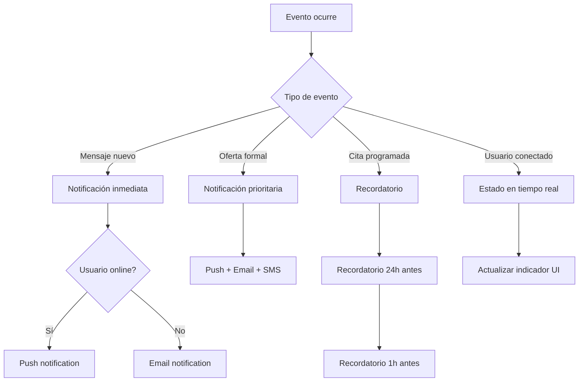

# Casos de Uso y Flujos de Trabajo - Sistema de Chat Inmobiliario

## 1. Casos de Uso Principales

### CU001 - Consulta Inicial de Propiedad

**Actor Principal**: Comprador  
**Actores Secundarios**: Vendedor, Sistema  
**Precondiciones**: 
- Comprador registrado y autenticado
- Propiedad publicada y activa

**Flujo Principal**:
1. Comprador navega por catálogo de propiedades
2. Comprador selecciona propiedad de interés
3. Comprador hace clic en "Contactar Vendedor"
4. Sistema verifica si ya existe conversación entre estas partes para esta propiedad
5. Si no existe, sistema crea nueva conversación
6. Sistema muestra interfaz de chat
7. Comprador escribe mensaje inicial con su consulta
8. Sistema envía mensaje y notifica al vendedor
9. Sistema confirma envío al comprador

**Flujos Alternativos**:
- **5a**: Si ya existe conversación, sistema abre conversación existente
- **8a**: Si vendedor no está disponible, sistema programa notificación por email

**Postcondiciones**:
- Conversación creada o reutilizada
- Mensaje inicial enviado
- Vendedor notificado

---

### CU002 - Respuesta del Vendedor

**Actor Principal**: Vendedor  
**Actores Secundarios**: Comprador, Sistema  
**Precondiciones**: 
- Vendedor registrado y autenticado
- Conversación existente con mensaje pendiente

**Flujo Principal**:
1. Vendedor recibe notificación de nuevo mensaje
2. Vendedor accede a la plataforma
3. Sistema muestra lista de conversaciones con indicadores de mensajes no leídos
4. Vendedor abre conversación específica
5. Sistema marca mensajes como leídos
6. Vendedor lee consulta del comprador
7. Vendedor redacta respuesta con información solicitada
8. Vendedor puede adjuntar archivos adicionales (fotos, documentos)
9. Vendedor envía respuesta
10. Sistema notifica al comprador

**Flujos Alternativos**:
- **8a**: Si archivo excede límite de tamaño, sistema muestra error
- **9a**: Si vendedor necesita más tiempo, puede enviar mensaje de confirmación de recepción

**Postcondiciones**:
- Respuesta enviada
- Comprador notificado
- Conversación actualizada

---

### CU003 - Solicitud de Intermediario

**Actor Principal**: Comprador o Vendedor  
**Actores Secundarios**: Intermediario, Sistema  
**Precondiciones**: 
- Conversación activa existente
- Usuario autenticado

**Flujo Principal**:
1. Usuario (comprador o vendedor) identifica necesidad de mediación
2. Usuario hace clic en "Solicitar Intermediario" en la conversación
3. Sistema muestra lista de intermediarios disponibles en la zona
4. Usuario selecciona intermediario preferido
5. Sistema envía invitación al intermediario
6. Sistema notifica a la otra parte sobre la solicitud
7. Intermediario recibe notificación
8. Intermediario revisa contexto de la conversación
9. Intermediario acepta o rechaza invitación
10. Si acepta, sistema agrega intermediario a la conversación
11. Sistema notifica a todas las partes

**Flujos Alternativos**:
- **9a**: Si intermediario rechaza, sistema sugiere alternativas
- **4a**: Si no hay intermediarios disponibles, sistema permite buscar por criterios ampliados

**Postcondiciones**:
- Intermediario agregado a conversación
- Todas las partes notificadas
- Historial de conversación compartido con intermediario

---

### CU004 - Realización de Oferta Formal

**Actor Principal**: Comprador  
**Actores Secundarios**: Vendedor, Intermediario, Sistema  
**Precondiciones**: 
- Conversación activa
- Comprador verificado
- Información básica de propiedad disponible

**Flujo Principal**:
1. Comprador decide hacer oferta formal
2. Comprador hace clic en "Hacer Oferta"
3. Sistema muestra formulario de oferta
4. Comprador completa datos:
   - Monto ofrecido
   - Términos de pago
   - Fecha de cierre propuesta
   - Condiciones especiales
5. Comprador confirma oferta
6. Sistema valida datos y guarda oferta
7. Sistema genera mensaje especial de "Oferta Formal"
8. Sistema notifica inmediatamente al vendedor
9. Si hay intermediario, también es notificado
10. Sistema marca oferta como "Pendiente"

**Flujos Alternativos**:
- **6a**: Si datos inválidos, sistema muestra errores específicos
- **5a**: Comprador puede guardar oferta como borrador

**Postcondiciones**:
- Oferta formal registrada
- Vendedor e intermediario notificados
- Conversación marcada como "Con oferta pendiente"

---

### CU005 - Respuesta a Oferta

**Actor Principal**: Vendedor  
**Actores Secundarios**: Comprador, Intermediario, Sistema  
**Precondiciones**: 
- Oferta formal recibida
- Vendedor autenticado

**Flujo Principal**:
1. Vendedor recibe notificación de oferta
2. Vendedor accede a conversación
3. Sistema resalta mensaje de oferta formal
4. Vendedor revisa detalles de la oferta
5. Vendedor selecciona respuesta:
   - Aceptar oferta
   - Rechazar oferta
   - Hacer contraoferta
6. **Si acepta**: Sistema marca oferta como aceptada y notifica
7. **Si rechaza**: Vendedor proporciona razón y sistema notifica
8. **Si contraoferta**: Vendedor completa formulario con nuevos términos
9. Sistema registra respuesta y notifica a todas las partes

**Flujos Alternativos**:
- **5a**: Vendedor puede solicitar tiempo para consultar con intermediario
- **8a**: Contraoferta sigue mismo flujo que oferta original

**Postcondiciones**:
- Respuesta registrada
- Estado de oferta actualizado
- Partes notificadas de la decisión

---

### CU006 - Programación de Cita de Visita

**Actor Principal**: Cualquier participante  
**Actores Secundarios**: Otros participantes, Sistema  
**Precondiciones**: 
- Conversación activa
- Al menos interés básico expresado

**Flujo Principal**:
1. Usuario hace clic en "Programar Visita"
2. Sistema muestra calendario con disponibilidad
3. Usuario selecciona fecha y hora preferida
4. Usuario puede agregar notas especiales
5. Sistema envía propuesta a otros participantes
6. Participantes confirman o proponen alternativas
7. Cuando todos confirman, sistema programa cita
8. Sistema envía recordatorios automáticos
9. Sistema crea evento en conversación

**Flujos Alternativos**:
- **6a**: Si hay conflicto, sistema sugiere horarios alternativos
- **7a**: Si no hay consenso en 48h, sistema permite reprogramar

**Postcondiciones**:
- Cita programada y confirmada
- Recordatorios configurados
- Evento visible en conversación

---

## 2. Flujos de Trabajo Detallados

### 2.1 Flujo Completo de Transacción

### 2.2 Flujo de Moderación y Resolución de Conflictos

### 2.3 Flujo de Notificaciones

## 3. Casos de Uso Secundarios

### CU007 - Gestión de Archivos en Conversación

**Flujo Principal**:
1. Usuario hace clic en "Adjuntar archivo"
2. Sistema abre selector de archivos
3. Usuario selecciona archivo(s)
4. Sistema valida tipo y tamaño
5. Sistema sube archivo a almacenamiento
6. Sistema genera mensaje con enlace al archivo
7. Sistema notifica a participantes

### CU008 - Búsqueda en Historial de Conversaciones

**Flujo Principal**:
1. Usuario hace clic en "Buscar"
2. Usuario ingresa términos de búsqueda
3. Sistema busca en mensajes accesibles
4. Sistema muestra resultados con contexto
5. Usuario puede navegar a mensaje específico

### CU009 - Configuración de Notificaciones

**Flujo Principal**:
1. Usuario accede a configuración
2. Usuario modifica preferencias de notificación
3. Sistema valida configuración
4. Sistema guarda preferencias
5. Sistema aplica nuevas reglas de notificación

## 4. Métricas y KPIs por Caso de Uso

### 4.1 Métricas de Rendimiento

| Caso de Uso | Métrica | Objetivo |
|-------------|---------|----------|
| CU001 | Tiempo de creación de conversación | < 2 segundos |
| CU002 | Tiempo de respuesta promedio | < 24 horas |
| CU003 | Tasa de aceptación de intermediarios | > 80% |
| CU004 | Conversión de consulta a oferta | > 15% |
| CU005 | Tiempo de respuesta a ofertas | < 48 horas |
| CU006 | Tasa de cumplimiento de citas | > 85% |

### 4.2 Métricas de Calidad

| Aspecto | Métrica | Objetivo |
|---------|---------|----------|
| Satisfacción | Rating promedio de conversaciones | > 4.0/5.0 |
| Eficiencia | Mensajes promedio hasta cierre | < 50 |
| Efectividad | Tasa de transacciones exitosas | > 25% |
| Usabilidad | Tasa de abandonos | < 10% |

## 5. Validaciones y Controles

### 5.1 Validaciones de Entrada
- **Mensajes**: Longitud máxima 2000 caracteres
- **Archivos**: Máximo 10MB, tipos permitidos definidos
- **Ofertas**: Montos dentro de rangos razonables
- **Fechas**: No pueden ser en el pasado

### 5.2 Controles de Negocio
- **Límite de conversaciones activas** por usuario
- **Tiempo máximo de inactividad** antes de archivar
- **Validación de permisos** en cada acción
- **Rate limiting** para prevenir spam

### 5.3 Puntos de Auditoría
- Todas las ofertas formales se registran
- Cambios de estado se logean
- Acceso a conversaciones se monitorea
- Archivos compartidos se rastrean